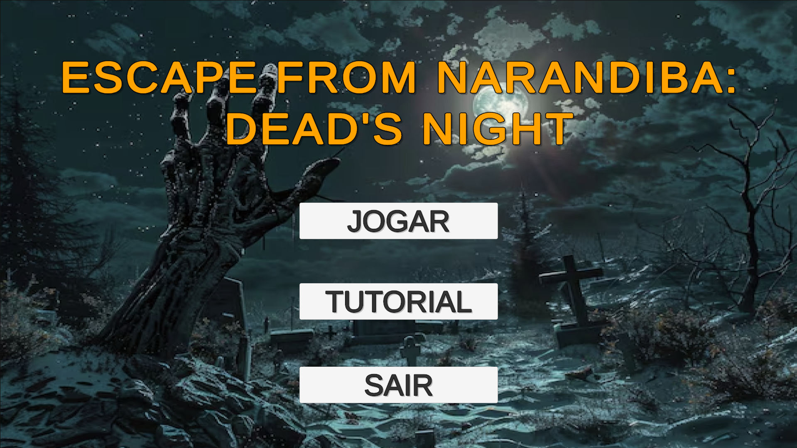
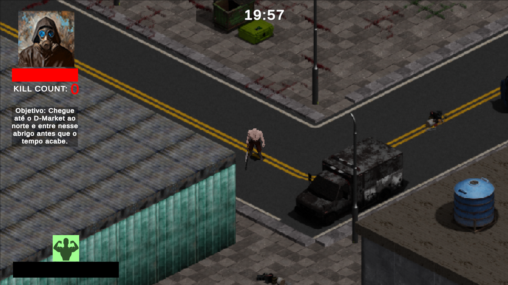
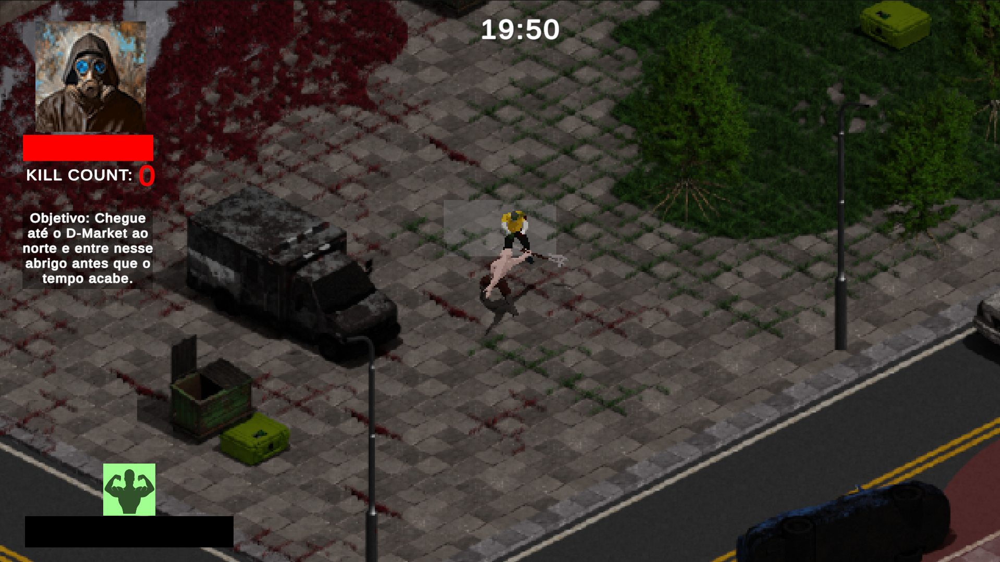

# Escape From Narandiba: Dead's Night

Esse é um jogo 2D desenvolvido na Unity Engine como avaliação para a disciplina de programação de jogos no curso de jogos digitais da Universidade do Estado da Bahia e tem por objetivo medir os conhecimentos obtidos na ferramenta Unity Engine.

 

# Gameplay

Jogue como Sargento Nascimento, um ex-militar que se encontrou diante de um apocalipse zumbi em narandiba. Certo dia você ouve no radio sobre a chegada de uma horda de zumbis no bairro, sendo informado também sobre a existencia de um local seguro, um abrigo capaz de garantir sua sobrevivência. Agora é hora de partir para o norte e procurar pelo supermercado D-Mart, mas cuidado, o tempo é curto, alcance seu objetivo antes que a horda chegue.

 
  

 
